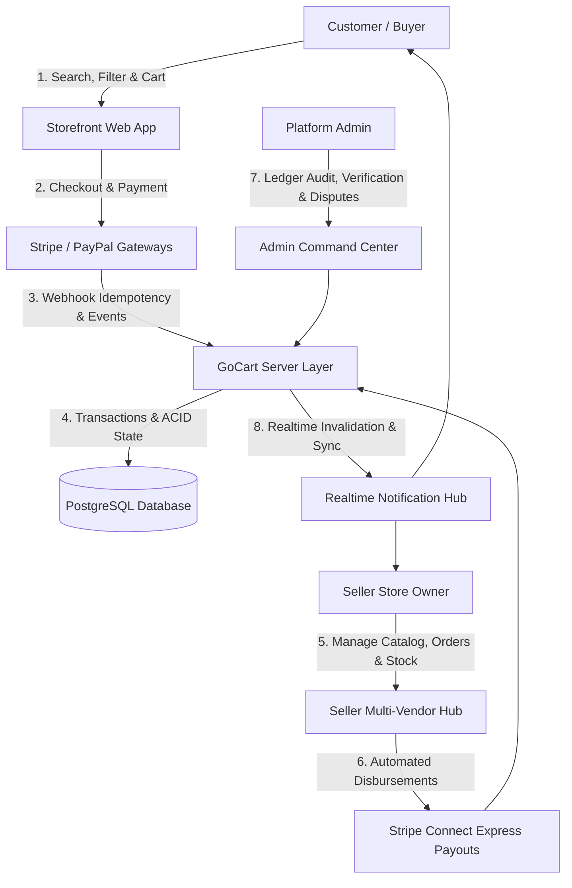

# GoCart — Multi-Vendor E-Commerce Platform

[](https://nextjs.org/)
[](https://react.dev/)
[](https://www.typescriptlang.org/)
[](https://www.prisma.io/)
[](https://www.postgresql.org/)
[](https://tanstack.com/query/latest)
[](https://tailwindcss.com/)
[](https://clerk.com/)
[](https://stripe.com/)
[](https://vitest.dev/)

GoCart is a multi-vendor e-commerce platform built with Next.js App Router, React 19, TypeScript, Prisma ORM, PostgreSQL, and TanStack Query. It unifies customer discovery, seller storefront management, real-time messaging, automated payout disbursements via Stripe Connect, and an administrative control hub.

---

## 🚀 Quick Test Accounts

The [`/sign-in`](http://localhost:3000/sign-in) page features a **Demo Accounts Panel** with one-click copy buttons for instant access across all three user roles:

| Role | Email | Password | Primary Surface | Permissions & Access |
| :--- | :--- | :--- | :--- | :--- |
| **Customer** | `user@email.com` | `123456789` | [`/profile`](http://localhost:3000/profile) | Storefront browsing, cart, checkout, returns, reviews & coin streaks |
| **Seller** | `seller@email.com` | `123456789` | [`/dashboard/seller/stores/srank`](http://localhost:3000/dashboard/seller/stores/srank) | Store studio, catalog & variants, inventory alerts, orders & Stripe payouts |
| **Admin** | `admin@email.com` | `123456789` | [`/dashboard/admin`](http://localhost:3000/dashboard/admin) | Platform analytics, store verification, settlement ledger & moderation |

---

## 🏗️ System Architecture & Workflow



---

## 🌟 Core Features & Capabilities

### 🛍️ 1. Customer Storefront (`/`, `/browse`, `/product/[slug]`, `/cart`)
- **Faceted Discovery Engine**: Instant brand filtering, star rating tiers (4★+, 3★+), price range inputs, color & size attributes, and reactive sorting without page reloads.
- **Dynamic Pricing & Multi-Currency**: Country detection via cookies with destination-specific shipping rates and live currency conversion.
- **Multi-Vendor Cart & Coupons**: Unified cart supporting items from multiple stores, store-specific coupon codes, and live fee breakdown.
- **Loyalty & Coin Streaks**: Daily check-in reward calendar, coin accumulation, and loyalty redemption discounts at checkout.
- **Order Tracking & Returns**: Self-service return requests, condition verification, replacement tracking, and item-level return workflows.

### 🏪 2. Seller Multi-Vendor Hub (`/dashboard/seller/stores/[storeUrl]`)
- **Storefront Studio**: Visual theme customizer, banner manager, and custom store navigation.
- **Catalog & Variant Management**: Multi-variant matrix builder, bulk image upload via Cloudinary, and AI-assisted description generator.
- **Real-Time Inventory Operations**: Stock alerts, low-stock threshold controls, manual stock adjustments, and automatic restock on returned items.
- **Order Fulfillment & Shipment**: Store-isolated order groups, packing slip generation, carrier tracking assignment, and status updates.
- **Seller Earnings & Stripe Connect**: Self-service Stripe Express onboarding, real-time earnings ledger, and automated payout disbursements.

### 🛡️ 3. Admin Command Center (`/dashboard/admin`)
- **Platform Analytics**: Total platform gross volume, commission calculations, store performance rankings, and customer metrics.
- **Settlement Ledger Engine**: Double-entry ledger tracking payouts, fees, refunds, and escrow balances.
- **Dispute Resolution & Moderation**: Customer claim oversight, review moderation, and store status verification.

---

## 📂 Repository Structure — What is Doing What & Why We Need That

```text
go-cart/
├── src/
│   ├── app/                              # Next.js App Router (Routing & Server Components)
│   │   ├── (store)/                      # Customer storefront routes (home, browse, cart, product)
│   │   │                                 # -> Fast SSR and responsive buyer discovery
│   │   ├── (auth)/                       # Authentication routes with Demo Test Accounts panel
│   │   │                                 # -> Clerk sign-in and sign-up with quick copy tools
│   │   ├── dashboard/                    # Seller and Admin control dashboards
│   │   │   ├── seller/                   # Seller store management (products, inventory, orders, earnings)
│   │   │   └── admin/                    # Admin command center (analytics, settlements, moderation)
│   │   └── api/                          # REST & Webhook endpoints
│   │       ├── webhooks/                 # Stripe, PayPal, and carrier tracking webhook handlers
│   │       ├── seller/stripe/onboard/    # Stripe Connect Express onboarding redirection
│   │       └── realtime/sync/            # Real-time event synchronization and polling probes
│   │
│   ├── components/                       # Reusable React UI components
│   │   ├── store/                        # Storefront components (browse filters, swiper, header, cart)
│   │   ├── dashboard/                    # Dashboard forms, data tables, analytics charts, modals
│   │   └── ui/                           # Radix UI primitives & styled design tokens
│   │
│   ├── queries/                          # Server actions & database query modules
│   │   ├── product.ts                    # Ranked search queries and faceted filter aggregation
│   │   ├── user.ts                       # Customer profiles, cart synchronization, and order placement
│   │   ├── inventory.ts                  # Stock adjustments, alert thresholds, and store overviews
│   │   ├── returns.ts                    # Return requests, replacement workflows, and evidence reviews
│   │   ├── disbursement.ts               # Stripe Connect transfer processing and settlement releases
│   │   └── coupon.ts                     # Coupon validation, discount application, and usage limits
│   │
│   ├── lib/                              # Core business logic, settlement engines, and security
│   │   ├── payments/                     # Stripe Connect & PayPal webhook reconciliation engines
│   │   ├── settlement/                   # Financial calculation services & automated payout reviews
│   │   ├── security/                     # Content sanitization, rate limiting, and RBAC guards
│   │   ├── returns/                      # Return state machines & inventory reconciliation
│   │   └── utils.ts                      # Slug generation, product history, and shipping date calculators
│   │
│   └── prisma/                           # Database ORM schema & migrations
│       └── schema.prisma                 # Schema definitions for Users, Stores, Products, Orders, Settlements
│
├── docs/                                 # Deep-dive architecture and policy documentation
├── public/                               # Static assets, demo banners, and icons
└── tests/                                # Unit, integration, and E2E test suites (Vitest & Playwright)
```

---

## ⚡ Getting Started

### Prerequisites
- **Node.js**: `v20+` or **Bun**: `v1.1+` (recommended)
- **PostgreSQL**: PostgreSQL 15+ database instance (or Neon Serverless Postgres)

### 1. Install Dependencies
```bash
bun install
```

### 2. Configure Environment Variables
Copy `.env.example` to `.env` and fill in your database, Clerk, and Stripe keys:
```bash
cp .env.example .env
```

### 3. Initialize Database & Seed
```bash
# Push Prisma schema to PostgreSQL
bun run db:prepare

# (Optional) Seed initial countries and demo catalog
bun run seed:countries
```

### 4. Run Development Server
```bash
bun dev
```

Open [http://localhost:3000](http://localhost:3000) in your browser.

---

## 🧪 Testing & Quality Assurance

GoCart maintains automated test coverage across financial calculations, inventory invariants, security boundaries, and user workflows.

| Test Suite | Command | Coverage Scope |
| :--- | :--- | :--- |
| **Unit & Integration** | `bun vitest run` | 65 test files, 413 tests (settlement, inventory, returns, security) |
| **Type Safety** | `bun run typecheck` | Strict TypeScript compilation (`tsc --noEmit`) |
| **Code Quality** | `bun run lint` | ESLint rules & code conventions |
| **End-to-End** | `bun run test:e2e` | Playwright browser automation tests across full user flows |

---

## 🤝 Development Workflow

1. Create a feature branch: `git checkout -b feature/your-feature-name`
2. Run validation checks: `bun vitest run && bun run typecheck && bun run lint`
3. Verify changes in BrowserOS or local browser at `http://localhost:3000`
4. Update knowledge graph: `python -m graphify update .`
5. Open a pull request against the `dev` branch.
